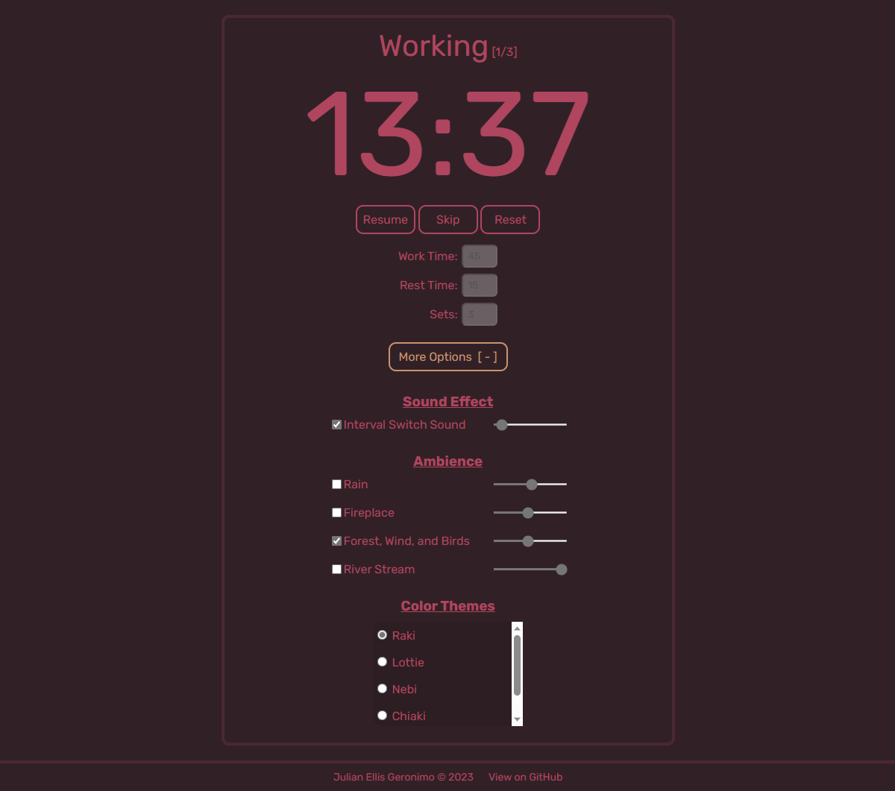
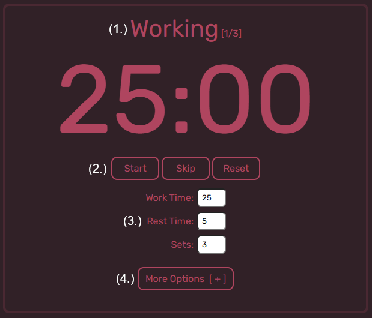
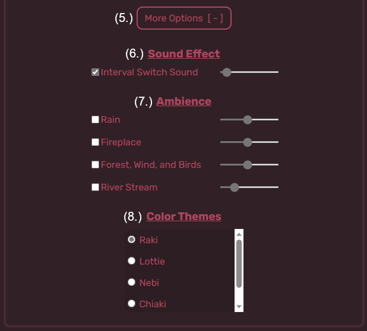
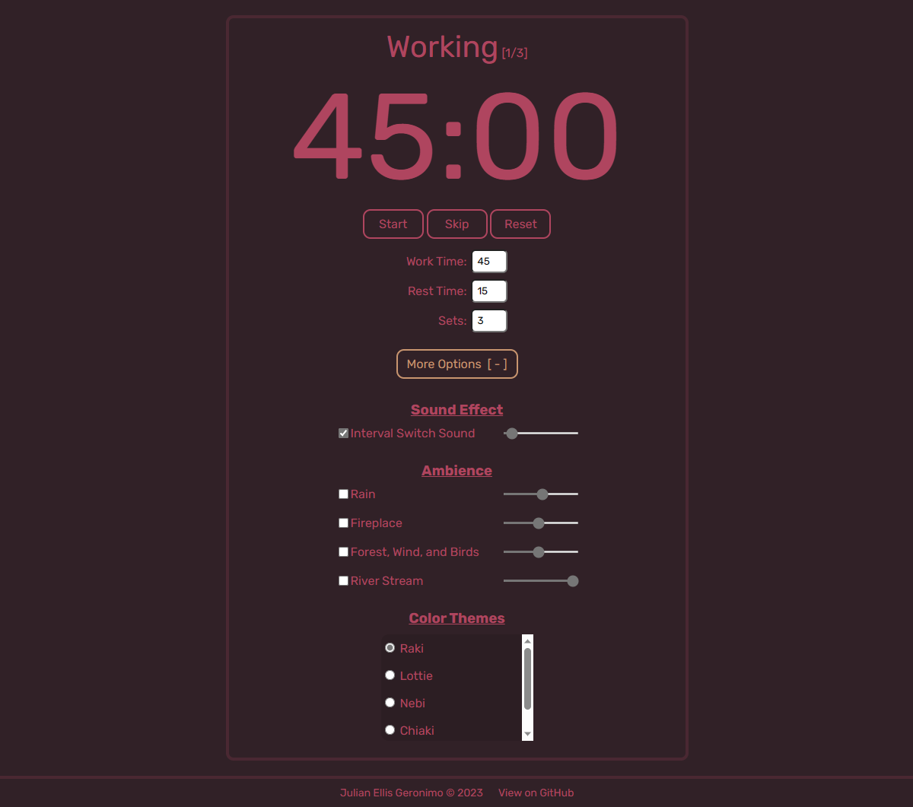
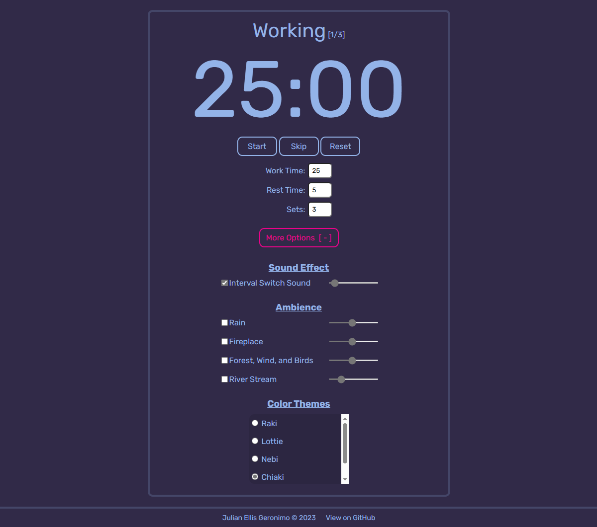

# About this Project
A Pomodoro Timer to help you time manage your work and help you reach your goals! Work at your own pace, choose a color theme, and set the mood!

Visit here: https://julellisg.github.io/Pomodoro-Timer/

    

(<a href="#readme-top">back to top</a>)

## :hammer: Built With

    
    
    

(<a href="#readme-top">back to top</a>)

## :rocket: Usage
<di style="display: flex; justify-content: center; align-items: center;">
    
</di

1. Progression. Informs you if you are **WORKING** or **RESTING**. The smaller number in square brackets represents what set you are currently on. 
2. You have the freedom of **pausing/resuming,** **skipping** to the next work/rest session, and **resetting** the timer completely. 
3. These input boxes While the timer is running, the input boxes are temporarily disabled and you cannot edit any values.
4. Button that is currently **unactive**. Pressing it reveals the accordion that reveals more options.

    

5. Button that is currently **active**.
6. Sound effects referring to what is played whenever the timer reaches `00:00`. If more sound effects are added, then they will be placed in this section. 
7. A wide variety of different ambient soundtracks to relax and to study to. Mix, match, and adjust the volumes to your desired output.
8. Different color themes to choose from. Raki (left) and Chiaki (right).
(Raki is my favorite :blush:)

    
    

(<a href="#readme-top">back to top</a>)

## :pencil: License
Distributed under the MIT License. See `LICENSE.txt` for more information.

(<a href="#readme-top">back to top</a>)

## :phone: Contact
- Julian Ellis Geronimo - julianellisg@gmail.com
- Project Link - https://github.com/Julellisg/Pomodoro-Timer

(<a href="#readme-top">back to top</a>)

## :book: Acknowledgements
This app is motivated by several Pomodoro Timers found on YouTube, as well as [Pomofocus](https://pomofocus.io/), by [Yuya Uzu](https://github.com/uzura89).

All sound effect(s) and ambient noises are taken from [Pixabay](https://pixabay.com/).
- **Interval Switch Sound** - [Correct 2](https://pixabay.com/users/pixabay-1/) - By [Pixabay](https://pixabay.com/users/pixabay-1/)
- **Rain**  - [Soft Rain Ambient](https://pixabay.com/sound-effects/soft-rain-ambient-111154/) - By [SoundsForYou (Michael)](https://pixabay.com/users/soundsforyou-4861230/)
- **Campfire** - [Campfire Crackling | Fireplace Sound](https://pixabay.com/sound-effects/campfire-crackling-fireplace-sound-119594/) - By [SoundsForYou (Michael)](https://pixabay.com/users/soundsforyou-4861230/)
- **Forest, Wind, and Birds** - [Forest wind and birds](https://pixabay.com/sound-effects/forest-wind-and-birds-6881/) - By [Pixabay](https://pixabay.com/users/pixabay-1/)
- **River Stream** - [Relaxing, Mountains, Rivers, Streams, Running Water](https://pixabay.com/sound-effects/relaxing-mountains-rivers-streams-running-water-18178/) - By [Pixabay](https://pixabay.com/users/pixabay-1/)

And the color themes are named after some virtual idols of PixelLink.

(<a href="#readme-top">back to top</a>)
